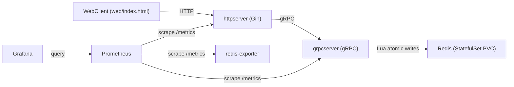
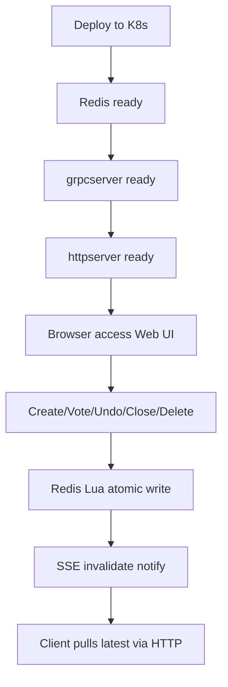

## 在线投票系统（vote-system）完整实现方案（可交付版）

本文档面向“把项目交付给他人阅读/复现/压测”的需求，结合你的《`在线投票系统设计方案.md`》与本仓库实现，给出从设计到落地的一整套说明。重点是**设计角度、功能实现角度、技术选型与取舍**，尽量少做代码陈列。

---

## 0. 目标与约束（验收口径）

- **本机演示**：kind 一键拉起后，浏览器完成“创建→投票→撤销→查看结果”，票数近实时更新。
- **一致性语义**（脚本可验证）：
  - **防重投**：同一用户对同一投票重复投票（无幂等 key）返回 **409**，计数不增加。
  - **防漏投**：并发投票计数不丢（最终总票数与期望一致）。
  - **自由撤销**：投票期内可撤销，票数回退，撤销后允许再次投票。
  - **幂等重试**：写请求携带相同 `Idempotency-Key` 重试不产生重复写入，返回一致结果。
- **云上单机压测**：k3s 单机部署，压测吞吐/延迟/错误率，采集服务与 Redis 指标。
- **技术栈约束**：Go、HTTP→gRPC→Redis、K8s、Prometheus+Grafana。

---

## 1. 服务划分与职责边界

### 1.1 为什么这样拆（最小可演示的微服务链路）

本项目采用“HTTP 网关 + gRPC 业务服务”的两层服务拆分，配合 Redis 状态引擎：

- **Web Client**：负责 UI/交互/订阅推送。
- **httpserver（HTTP 网关）**：负责 HTTP/JSON API、鉴权与限流、SSE 推送通道、把请求透传为 gRPC 调用。
- **grpcserver（业务服务）**：负责业务校验与状态变更，所有关键写入通过 Redis Lua 原子脚本完成。
- **Redis**：存储投票元信息、计数、去重集合、用户投票记录与幂等键。
- **Prometheus/Grafana**：采集指标、展示与告警。

这样拆分的优点：

- 能展示典型“Web → HTTP → gRPC → Store”的生产链路形态；
- 同时仍保持落地复杂度可控，适合本机与单机云压测。

### 1.2 运行时架构与数据流




---

## 2. 数据结构设计

### 2.1 对外对象（业务视角）

- **Poll（投票）**：`id`、`question`、`options[]`、`votes{option->count}`、`created_by`、`updated_by`、`created_at`、`expires_at`、`is_closed`、`is_public`
- **MyVote（我的投票）**：`poll_id`、`option`、`poll`（用于结果页展示“我投了什么 + 当前票数”）

### 2.2 Redis 数据模型（存储视角）

Redis 采用 Hash/Set 为主，兼顾“计数”“去重”“撤销”“查询展示”。

- **投票元信息**：`poll:{poll_id}`（Hash）
  - `id / question / created_by / updated_by / created_at / expires_at / is_closed / is_public`
- **选项列表**：`poll:{poll_id}:options`（Hash，field=0..n-1，保持顺序）
- **票数计数**：`poll:{poll_id}:votes`（Hash，field=option，value=int）
- **去重集合**：`poll:{poll_id}:voters`（Set，member=user_id）
- **用户投票历史**：`user:{user_id}:votes`（Hash，field=poll_id，value=option）
- **幂等键**：`idem:{user_id}:{idempotency_key}`（String，TTL=5m）
  - CreatePoll 时 value 存储 `poll_id`（用于“重复创建返回同一 poll”）

### 2.3 Redis-only 与持久化（安全性取舍）

项目默认 **Redis-only**，并通过持久化降低风险：

- AOF：`appendonly yes` + `appendfsync everysec`
- RDB：定期快照兜底
- K8s：StatefulSet + PVC（数据目录 `/data`）

配置模板：`configs/redis/redis.conf`  
K8s 资源：`deployments/k8s/base/redis.yaml`

> 说明：Redis-only 在极端故障下仍可能存在秒级风险；当前目标（演示 + 单机压测）可接受。若要进一步提升安全性，可在后续引入 MySQL 事实库（异步落库或主库+缓存），但会带来双写一致性与性能权衡。

---

## 3. 接口文档（HTTP + gRPC）

### 3.1 通用约定

- **身份**：演示环境使用请求头 `X-User-Id`。
  - SSE 场景（`EventSource` 无法带自定义 header）同时支持 `?user_id=` 与 cookie `user_id`。
- **幂等**：写接口支持请求头 `Idempotency-Key`（可选，但推荐给脚本/重试/重复点击场景）。
- **状态码**：
  - 200 成功
  - 400 参数非法
  - 401 未登录（缺少用户 ID）
  - 403 投票已关闭/过期/无权限
  - 404 资源不存在
  - 409 冲突（重复投票/不可撤销等）

### 3.2 HTTP API（前端直接调用）

#### A. 创建者（poll）

- `POST /polls/createPoll`：创建投票（body：question/options/expires_at/is_public）
- `GET /polls/close/:id`：关闭投票
- `GET /polls/delete/:id`：删除投票
- `GET /polls/my_created/stats`：我创建的投票统计（分页 cursor）

#### B. 投票者（vote）

- `POST /votes/:poll_id/vote`：投票（body：option）
- `DELETE /votes/:poll_id/vote`：撤销投票
- `GET /users/me/votes`：我参与的投票列表

#### C. 公共查询

- `GET /polls/:id`：投票详情
- `GET /polls/public`：公开投票列表
- `GET /polls/public/stats`：公开投票统计

#### D. 实时推送（SSE）

- `GET /events/results`：结果页聚合推送（event：`invalidate`）
- `GET /events/polls/:poll_id`：单个投票推送（event：`poll_invalidate`）

### 3.4 API 请求/响应样例（可复制）

以下示例以本机访问为例：`BASE_URL=http://localhost:8080`。\n所有请求都需要 `X-User-Id`，写请求可选 `Idempotency-Key`。

#### 3.4.1 创建投票（CreatePoll）

请求：

```bash
curl -sS -X POST "http://localhost:8080/polls/createPoll" \
  -H "Content-Type: application/json" \
  -H "X-User-Id: user_1" \
  -H "Idempotency-Key: create-001" \
  -d '{
    "question":"你更喜欢哪种技术话题？",
    "options":["Go 并发","Kubernetes","Redis"],
    "expires_at":"2030-01-01T00:00:00Z",
    "is_public": true
  }'
```

成功响应（示例字段）：

```json
{
  "id": "7c3f0e2c-....",
  "question": "你更喜欢哪种技术话题？",
  "options": ["Go 并发","Kubernetes","Redis"],
  "votes": {"Go 并发":0,"Kubernetes":0,"Redis":0},
  "createdBy": "user_1",
  "updatedBy": "user_1",
  "createdAt": {"seconds":"...","nanos":0},
  "expiresAt": {"seconds":"...","nanos":0},
  "isClosed": false,
  "isPublic": true
}
```

幂等行为：同一用户重复调用（相同 `Idempotency-Key`）会返回**同一个** `id`。

#### 3.4.2 投票（Vote）

请求：

```bash
curl -sS -X POST "http://localhost:8080/votes/7c3f0e2c-.../vote" \
  -H "Content-Type: application/json" \
  -H "X-User-Id: voter_a" \
  -H "Idempotency-Key: vote-a-001" \
  -d '{"option":"Redis"}'
```

成功响应：返回更新后的 `Poll`（票数已变化）。

重复投票（无幂等 key 的重复请求）：

```bash
curl -i -X POST "http://localhost:8080/votes/7c3f0e2c-.../vote" \
  -H "Content-Type: application/json" \
  -H "X-User-Id: voter_a" \
  -d '{"option":"Redis"}'
```

典型响应：

- HTTP `409`
- body：`{"error":"conflict"}`（或等价错误信息）

#### 3.4.3 撤销投票（UndoVote）

请求：

```bash
curl -sS -X DELETE "http://localhost:8080/votes/7c3f0e2c-.../vote" \
  -H "X-User-Id: voter_a" \
  -H "Idempotency-Key: undo-a-001"
```

成功响应：返回更新后的 `Poll`（对应选项票数回退）。

#### 3.4.4 结果页 SSE（invalidate）

请求（浏览器/命令行均可，示例使用 curl 观察事件流）：

```bash
curl -N "http://localhost:8080/events/results?user_id=user_1"
```

服务端会推送 `event: invalidate`，data 中包含哪些视图需要刷新，例如：

```json
{"myVotes":true,"publicStats":true,"myCreated":true}
```

### 3.3 gRPC（httpserver → grpcserver）

协议定义：`api/proto/voting/v1/voting.proto`  
说明：HTTP 层将 `Idempotency-Key` 透传到 gRPC 字段 `idempotency_key`。

---

## 4. 系统运行流程与用户操作流程

### 4.1 系统运行流程（从部署到交互）




### 4.2 用户操作流程（页面视角）

- **登录**：输入用户 ID（写入 `sessionStorage user_id`，并写 cookie `user_id` 以便 SSE 鉴权）。
- **创建**：创建投票 → 返回 poll_id 与分享链接（`/#/poll/{id}`）。
- **参与**：进入投票详情 → 选择选项投票 → 票数更新。
- **撤销**：撤销投票 → 票数回退 → 可再次投票。
- **结果**：结果页聚合展示“我创建 / 我参与 / 公开投票”，并通过 SSE 近实时刷新。

### 4.3 关键写操作时序图（创建/投票/撤销）

#### 4.3.1 创建投票（CreatePoll）

```mermaid
sequenceDiagram
  participant U as User
  participant H as httpserver
  participant G as grpcserver
  participant R as Redis

  U->>H: POST /polls/createPoll (X-User-Id, Idempotency-Key)
  H->>G: gRPC CreatePoll(user_id, idempotency_key, poll)
  G->>R: EVAL createPollScript (SET NX EX idem; HSET meta; init votes/options)
  R-->>G: {code, poll_id}
  G->>R: HGETALL/HGETALL (load poll snapshot)
  R-->>G: Poll data
  G-->>H: Poll
  H-->>U: 200 Poll
```


#### 4.3.2 投票（Vote）

```mermaid
sequenceDiagram
  participant U as User
  participant H as httpserver
  participant G as grpcserver
  participant R as Redis

  U->>H: POST /votes/{poll_id}/vote (option, Idempotency-Key?)
  H->>G: gRPC Vote(user_id, poll_id, option, idempotency_key)
  G->>R: EVAL voteScript (check closed/expiry; SISMEMBER; HINCRBY; record user vote; idem)
  R-->>G: result_code
  G->>R: HGETALL/HGETALL (load poll snapshot)
  R-->>G: Poll data
  G-->>H: Poll / error mapped
  H-->>U: 200 Poll OR 409 conflict
  note over H: On success, notify SSE invalidate
```


#### 4.3.3 撤销（UndoVote）

```mermaid
sequenceDiagram
  participant U as User
  participant H as httpserver
  participant G as grpcserver
  participant R as Redis

  U->>H: DELETE /votes/{poll_id}/vote (Idempotency-Key?)
  H->>G: gRPC UndoVote(user_id, poll_id, idempotency_key)
  G->>R: EVAL undoScript (verify voted; get opt; HINCRBY -1; SREM; HDEL; idem)
  R-->>G: result_code
  G->>R: HGETALL/HGETALL (load poll snapshot)
  R-->>G: Poll data
  G-->>H: Poll / error mapped
  H-->>U: 200 Poll OR 409 conflict
  note over H: On success, notify SSE invalidate
```


---

## 5. 技术实现（实时更新 + 一致性语义机制）

### 5.1 实时更新：SSE（Server-Sent Events）+ 失效通知（invalidate）

#### 为什么选 SSE

- 浏览器原生支持、自动重连、部署简单；
- 业务上只需要“服务端通知客户端数据变化”，无需双向通信；
- 结合“invalidate → 客户端拉取最新数据”，能减少推送负载并保持一致的渲染来源。

#### 实现策略（设计要点）

- 服务端不推全量 poll/列表，而是推送“哪些视图需要刷新”：
  - 结果页：`invalidateMsg{myVotes/publicStats/myCreated}`
  - 单 poll 页：`pollInvalidateMsg{pollId,reason}`
- 客户端收到 SSE 事件后，调用既有 HTTP API 获取最新结果，保证展示一致。

实现文件（用于定位实现而非代码展示）：

- SSE handler：`internal/http/handler/sse.go`
- 连接管理：`internal/http/handler/sse_hub.go`
- 前端订阅：`web/static/app.js`

### 5.2 防重投（同用户同投票只记一次）

设计目标：即使并发/重试，也不会重复计数。

实现（Redis Lua 原子写）：

- `poll:{poll_id}:voters` Set 作为“是否已投票”的唯一事实；
- Lua 中先 `SISMEMBER` 判重，再一次性执行：
  - `SADD voters user_id`
  - `HINCRBY votes option +1`
  - `HSET user:{user_id}:votes poll_id option`
- 重复投票（无幂等 key）返回冲突 → HTTP 409。

### 5.3 防漏投（高并发计数不丢）

实现要点：

- 计数使用 Redis 原子 `HINCRBY`；
- 不拆为“先读后写”的多条命令，避免竞态丢失；
- 所有关键写操作都在 Lua 中一次提交，减少部分成功/部分失败。

### 5.4 自由撤销（Undo）

实现要点：

- 撤销前必须能定位用户当时的选择：`user:{user_id}:votes[poll_id] -> option`
- Lua 原子执行：
  - `SREM voters user_id`
  - `HINCRBY votes option -1`（并兜底不小于 0）
  - `HDEL user:{user_id}:votes poll_id`
- 撤销后允许再次投票（因为 voters 集合移除了用户）。

### 5.5 幂等重试（Idempotency-Key）

设计目标：网络重试/重复点击不会造成重复写。

实现要点：

- idem key 按 **用户维度隔离**：`idem:{user_id}:{key}`
- TTL 默认 5 分钟（足够覆盖常见重试窗口，避免永久占用）
- Vote/Undo：
  - Lua 先检查 idem 是否存在，存在直接返回 noop（不再写）。
- CreatePoll：
  - Lua 通过 `SET NX EX` 预占 idem，预占成功才创建；预占失败则返回已绑定的 `poll_id`。

### 5.6 其他工程性设计（边界防御）

- **鉴权**：`X-User-Id` 必填（SSE 支持 query/cookie 兼容）。
- **限流**：令牌桶（全局 + per-user），用于防止演示/压测时网关被单用户打穿。

---

## 6. 前端设计方案（信息架构 + 交互）

### 6.1 信息架构

前端是 hash route 的轻量 SPA，核心页面：

- 登录（输入用户 ID）
- 首页（入口导航）
- 创建投票（主题/时长/选项/公开）
- 参与投票（输入 poll_id + 公共列表）
- 投票详情（投票/撤销 + SSE 刷新）
- 结果页（我创建/我参与/公开结果 + SSE 增量刷新）

### 6.2 交互要点

- 前端对选项做“逐行、去空格、去重”预校验，减少错误提交；
- 所有错误以 toast 呈现，成功操作给出明确反馈；
- SSE 连接状态可视化（connected/reconnecting/unavailable）。

---

## 7. 部署方案（本机 kind + 云上 k3s）

### 7.1 镜像与构建

- `Dockerfile.httpserver`、`Dockerfile.grpcserver`
- 本机演示默认镜像：`voting/httpserver:local`、`voting/grpcserver:local`

### 7.2 本机演示（kind）

- 一键部署：`scripts/local_kind_up.ps1`
  - 创建 kind 集群 + metrics-server（HPA）
  - build 镜像并 load 到 kind
  - apply `deployments/k8s/base`
  - port-forward 到 `http://localhost:8080`

### 7.3 云上单机压测（k3s）

- 一键部署：`scripts/cloud_k3s_up.sh`
- overlay：`deployments/k8s/overlays/k3s` 将 `httpserver` 暴露为 NodePort 30080

---

## 8. 可观测性（指标、Dashboard、告警）与一键化

### 8.1 已落地的指标集合（面向压测）

- HTTP 网关：QPS、状态码分布、延迟直方图
- gRPC 业务：RPC 量、错误码、延迟
- 业务语义：`voting_business_vote_ops_total{op,result}`
- Redis：redis-exporter 指标（ops/sec、内存、持久化等）
- K8s：kube-state-metrics / node-exporter（集群与节点资源）

### 8.2 一键安装与 overlay apply

- 安装 kube-prometheus-stack（并自动 apply overlay）：
  - Windows：`scripts/observability_up.ps1`
  - Linux：`scripts/observability_up.sh`
- overlay 内容：`deployments/k8s/observability/`
  - ServiceMonitor、redis-exporter、PrometheusRule、Grafana dashboard

### 8.3 port-forward（本机）

- Grafana：`scripts/portforward_grafana.ps1` / `scripts/portforward_grafana.sh`
- Prometheus：`scripts/portforward_prometheus.ps1` / `scripts/portforward_prometheus.sh`

默认账号：Grafana `admin / admin`（values 文件中配置）。

---

## 9. 测试方案（功能正确性 + 压力测试）

### 9.1 功能正确性（k6）

- 脚本：`scripts/test_correctness.js`
- 运行：`scripts/run_correctness.ps1` / `scripts/run_correctness.sh`

覆盖项：

- CreatePoll 幂等、Vote 幂等、防重投、撤销与撤销幂等、防漏投（总票数匹配）

### 9.2 压力测试（k6）

- 脚本：`scripts/bench_vote.js`（constant-arrival-rate）
- 运行：`scripts/run_bench.ps1` / `scripts/run_bench.sh`

推荐步骤：

- 预热后逐步提升 `RATE`，记录拐点（错误率、p95/p99、Redis 内存/ops、CPU）。

### 9.3 压测报告模板（建议直接复制填写）

> 目标：让别人不看代码也能复现实验，并清楚知道“跑了什么、结果如何、瓶颈在哪里、下一步怎么优化”。\n> 建议将本章节复制到 `reports/bench_YYYYMMDD.md` 之类的文件中做归档。

#### A. 基本信息

- **测试日期**：YYYY-MM-DD
- **测试人**：
- **代码版本**：git commit / tag（若无 git，可填压测前打包时间）
- **部署形态**：kind / k3s（单机云）/ 其他
- **入口地址**：`BASE_URL=...`
- **可观测**：Prometheus/Grafana 是否启用（是/否），Dashboard UID（如 `voting-minimal`）

#### B. 环境信息（必须写清楚）

- **云厂商/地域/可用区**：
- **机器规格**：CPU 核数、内存、磁盘类型、网络带宽
- **OS/内核**：
- **K8s 版本**：kind/k3s 版本
- **容器运行时**：containerd/docker 版本
- **副本数**：httpserver=、grpcserver=、redis=
- **资源限制**（requests/limits）：（如有）
- **Redis 配置**：AOF/RDB 策略、maxmemory、持久化盘类型

#### C. 负载模型（k6 参数）

- **脚本**：`scripts/bench_vote.js`
- **场景类型**：constant-arrival-rate
- **RATE**：___ rps
- **DURATION**：___
- **PRE_VUS / MAX_VUS**：___ / ___
- **请求分布**：投票占比（100% vote）/ 是否包含查询（如需扩展请说明）
- **幂等策略**：是否使用 `Idempotency-Key`（本脚本默认不加）

#### D. 结果摘要（写结论，不只贴数字）

- **可稳定吞吐（SLO 内）**：___ rps（满足错误率 < 1%，p95 < ___ms，p99 < ___ms）
- **峰值吞吐**：___ rps（开始出现明显排队/错误的点）
- **主要瓶颈判断**：CPU / Redis / 网络 / 连接数 / 其他
- **错误类型**：HTTP 4xx/5xx 分布；主要错误码/原因

#### E. k6 输出（建议贴关键行）

- `http_req_duration`：p50/p95/p99
- `http_req_failed`：失败率
- `iterations` / `dropped_iterations`（如果使用 arrival-rate 场景）

#### F. 可观测指标截图/记录（Prometheus/Grafana）

建议记录以下时间窗口内曲线（同一时间段）：

- **网关层**：QPS、5xx 错误率、p95/p99 延迟
- **业务层**：gRPC non-OK 比例、gRPC 延迟
- **Redis**：ops/sec、内存、AOF rewrite、CPU（如 exporter 暴露）
- **K8s**：Pod CPU/内存、重启次数、节点 CPU steal（云环境常见）

#### G. 优化建议与下一步实验

- **短期（配置/资源）**：如调整副本、requests/limits、Redis maxmemory、NodePort/Ingress、连接池等
- **中期（代码/结构）**：如减少拉取频率、批量查询、减少无效刷新、优化 Lua 脚本与 key 设计
- **长期（架构）**：如 Redis Sentinel/Cluster、多节点、冷热数据分离、引入事实库等

---

## 10. 推荐复现路径（给他人照抄即可）

### 10.1 本机（Windows）一键演示 + 可观测 + 正确性测试

1. `powershell scripts\\local_kind_up.ps1`
2. `powershell scripts\\local_kind_obs_up.ps1`
3. 新开终端：`powershell scripts\\portforward_grafana.ps1`
4. 新开终端：`powershell scripts\\portforward_prometheus.ps1`
5. `powershell scripts\\run_correctness.ps1`

### 10.2 云上单机（Linux）压测

1. `bash scripts/cloud_k3s_up.sh`
2. `bash scripts/cloud_k3s_obs_up.sh`
3. `BASE_URL=http://<ip>:30080 RATE=500 DURATION=120s bash scripts/run_bench.sh`

---

## 11. 目录与文件索引（实现落点）

- **设计方案**：`在线投票系统设计方案.md`
- **协议**：`api/proto/voting/v1/voting.proto`
- **前端**：`web/index.html`、`web/static/app.js`、`web/static/style.css`
- **HTTP 网关**：`cmd/httpserver/`、`internal/http/`
- **gRPC 业务**：`cmd/grpcserver/`、`internal/grpc/`、`internal/service/`
- **Redis store + Lua**：`internal/store/redis/`
- **Redis 配置**：`configs/redis/redis.conf`
- **部署（K8s）**：`deployments/k8s/base/`、`deployments/k8s/overlays/k3s/`
- **可观测 overlay**：`deployments/k8s/observability/`
- **脚本**：`scripts/`（kind/k3s/observability/port-forward/k6）

